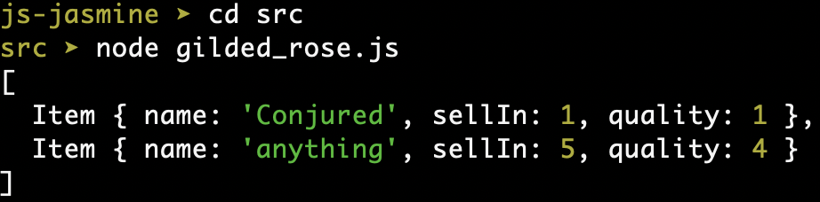
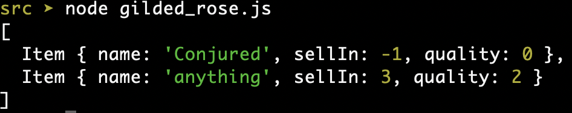

## Instructions
1. ``git clone git@github.com:joshjames279/gilded-rose-refactoring-challenge.git``
2. ``npm install`` in the js-jasmine directory to install project dependencies.

## Running the tests

This project uses the jasmine test framework.

Run the tests using ``npm test`` in the js-jasmine directory.

## Domain Model

| Object | Messages | Properties | Context | Output |
|------|------|------|------|------|
| AgedBrie | update | item(object) | Updates an 'Aged Brie' item to the requirements specified, plus makes sure it can't start with irregular quality values. | Object |
| BackstagePass | update | item(object) | Updates an 'Backstage passes to a TAFKAL80ETC concert' item to the requirements specified, plus makes sure it can't start with irregular quality values. | Object |
| Sulfuras | update | item(object) | Keeps Sulfuras the same, plus makes sure it can't start with irregular quality or sellIn values. | Object |
| Regular | update | item(object) | Updates a standard item to the requirements specified, plus makes sure it can't start with irregular quality values. | Object |
| Conjured | update | item(object) | Updates an 'Conjured' item to the requirements specified, plus makes sure it can't start with irregular quality values. | Object |
| Item | | name | | String |
| | | sellIn | Number of days to sell the item by. | Integer |
| | | quality | How valuable the item is. | Integer |
| Inventory | | | Is an object that helps the 'updateQuality' method in the class 'Shop' choose the correct class to use to update an item's properties for each day passed. | Class |
| Shop | | items(array) | The list of items in the Gilded Rose shop to have their properties updated at the end of a day. | |
| | updateQuality | items(array) | Goes through a list of items in the Gilded Rose shop and updates their properties at the end of each day, depending on what kind of item they are. | Array |

## How to use

Hi and welcome to team Gilded Rose. As you know, we are a small inn with a prime location in a
prominent city ran by a friendly innkeeper named Allison. We also buy and sell only the finest goods.
Unfortunately, our goods are constantly degrading in quality as they approach their sell by date. We
have a new system in place that updates our inventory for us. For more information on the various fine products we sell and their specifications, please go to the ``GildedRoseRequirements.txt`` file.

To use this new system you should interact with the code via the Javascript console.

Here is an example of how to use it:

Firstly create the shop by using the Shop class and within it put an array of items on your stocklist, each item will have to be created using the Item class.

Each item should have a name as the first index, a sellIn value as the second and a quality value as the third.

```js
const gildedRose = new Shop([ new Item('Conjured', 2, 3), new Item('anything', 6, 5) ]);
```

At the end of each day our new system changes the values for every item as appropriate to their specifications. To implement this end of day change and view it, use the ```console.log()``` function with the gildedRose Shop  with an ```updateQuality()``` function at the end.

```js
console.log(gildedRose.updateQuality());
```

Then go to your terminal and move into the ```src``` directory and input ```node gilded_rose.js```.

You should recieve an output of updated items at the end of the day. 



You can repeat this last function as many times as you like, so for as many days as necessary. For example if I wanted to see the values of my items after three days I would input the following into the JavaScript console:

```js
const gildedRose = new Shop([ new Item('Conjured', 2, 3), new Item('anything', 6, 5) ]);
gildedRose.updateQuality();
gildedRose.updateQuality();
console.log(gildedRose.updateQuality());
```

Then when I go to my terminal I would get the following result:



## References

See ```OriginalReadMe``` file in js-jasmine directory.