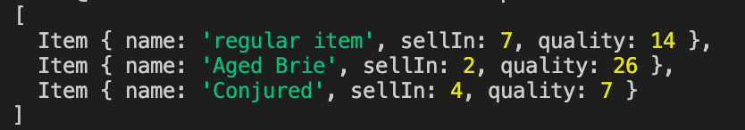

# Gilded Rose
## Instructions
1. Fork this repo
```
git clone git@github.com:hanna-98/gilded-rose-refactoring-challenge.git
```
2. Run ```npm install``` in your terminal to install the dependencies for this project

## Running tests
Use ```npx jasmine``` or ```npm test``` to run the tests

## Usage
In shop.js create a new instance of shop and pass in the items you wish to update with their current sell in and quality values (in that order.) For example:
```javascript
let shop = new Shop([new Item('regular item', 8, 15), new Item('Aged Brie', 3, 25), new Item('Conjured', 5, 9)])
```
Then you can call the ```update()``` function on ```shop``` and log it to the console to see how the sellIn and quality properties change at the end of the day:
```javascript
let example = shop.update()
console.log(example)
```
Output:



## Domain Model
| Object | Messages | Properties | Context | Output |
|--------|----------|------------|---------|--------|
| Shop | update() | | updates items passed in | array |
| AgedBrie | updateQuality() | item @obj | updates item's sellIn and quality properties | object |
| BackstagePass | updateQuality() | item @obj | updates item's sellIn and quality properties | object |
| Conjured | updateQuality() | item @obj | updates item's sellIn and quality properties | object |
| Item | | name @str | name of item | |
| | | sellIn @num | number of days before item expires | |
| | | quality @num | value of item as a number | |
| RegularItems | updateQuality() | item @obj | updates item's sellIn and quality properties | object |
| Sulfuras | updateQuality() | item @obj | updates item's sellIn and quality properties | object |

